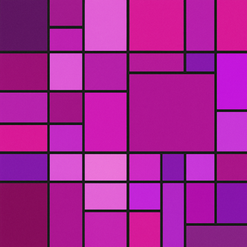

  

<h1 align="center">Magenta</h1>

### What is Magenta?
**Magenta** is a C++ class library that is a result of chronic accumulation of generic code from applicative domains.

It often provides a conceptual wrapper around 3rd party libraries, and therefore serves as a playground for language experiments.

### Build

**Magenta** relied on **Freemason** build system.
